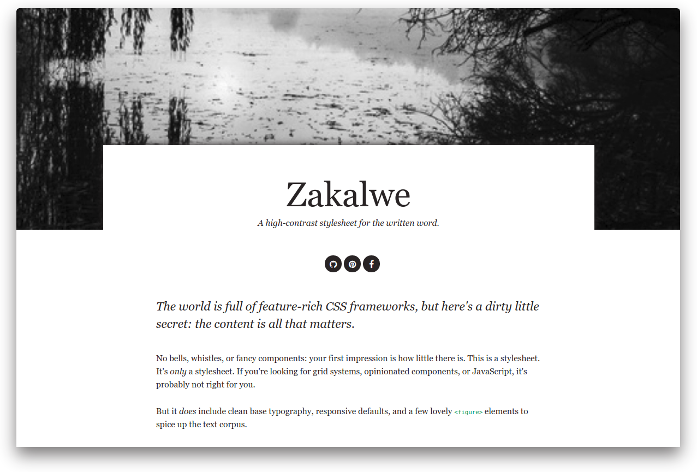

# Zakalwe

[](https://travis-ci.org/rjz/zakalwe)

A stylesheet worth writing to: responsive, easy on the eyes, and little else.

[Demo](https://rjz.github.io/zakalwe/)



## Usage

Zakalwe builds are available via unpkg:

```html
<link rel="stylesheet" href="https://unpkg.com/zakalwe/zakalwe.min.css" />
```

## Development

    $ npm install
    $ npm run build

## Test

    $ npm run lint

## In The Wild

  * [rjzaworski.com](https://rjzaworski.com)
  * [grainandflame.com](http://grainandflame.com)

## License

[ISC](LICENSE)
